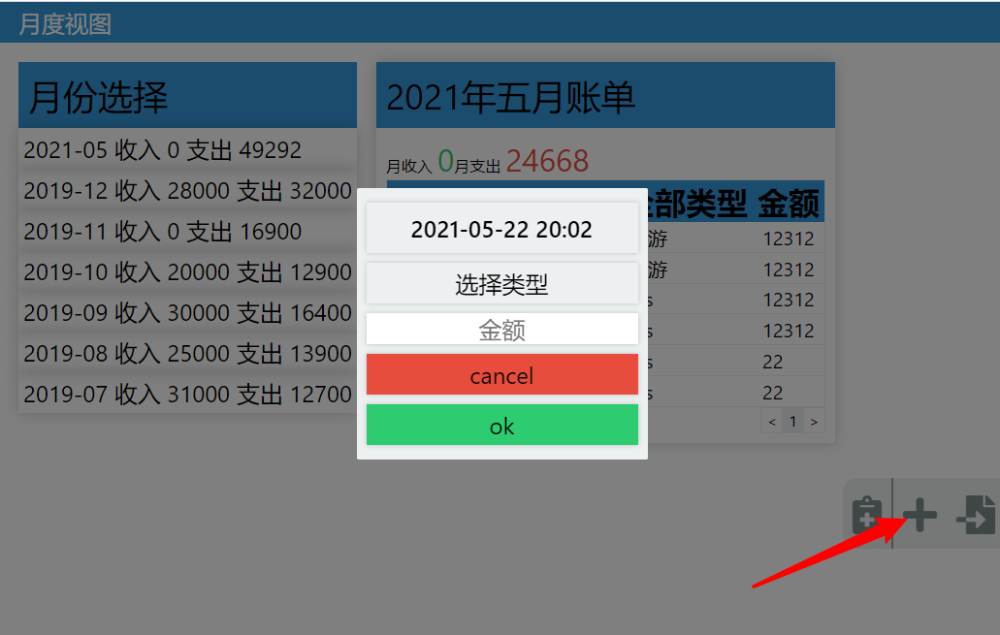

# 说明
此代码完成了xmind的前端面试题 https://github.com/xmindltd/hiring/tree/master/frontend-1

前端采用react，后端koa + sqlite。

如果对你也有帮助，可以随意使用。

 

# 如何安装此sample：

首先clone此仓库，然后进入对应的文件夹中，通过终端执行 npm run install 安装依赖。

使用 npm run test 可以运行单元测试，测试只覆盖了后端代码。

你有两种方式可以启动此项目：

 

### 开发模式

1. npm run serve 启动后端服务，后端将会在3001端口打开服务
2. npm start 启动前端，react的开发测试服务器将会在3000打开，浏览器会自动弹出并打开首页

### 生产模式

1. npm run build 打包前端资源
2. npm run serve 启动服务，然后通过localhost:3001访问 

 

# 使用方法：

如箭头所指位置的按钮可以弹出工具条，里面提供两种添加账单的方式，按从左向右的顺序分别是：

1. 添加账目
2. 导入账单

## 导入账单
在仓库的docs中已经放置了题目所要求的两个账单文件，点击导入账单按钮将弹出文件选择器，同时选择这两个账单（注意一定要同时上传两个文件，否则会找不到账单类型），然后确定，稍等一下账单列表即自动刷新。

## 添加账单
点击添加账单按钮将弹出输入器，输入对应的信息点ok即可。

注意，通过打开类型选择器可以添加新的类型

## 筛选

按月筛选直接通过月份选择器即可

 

月内筛选和排序，通过表头的功能按钮选择。

